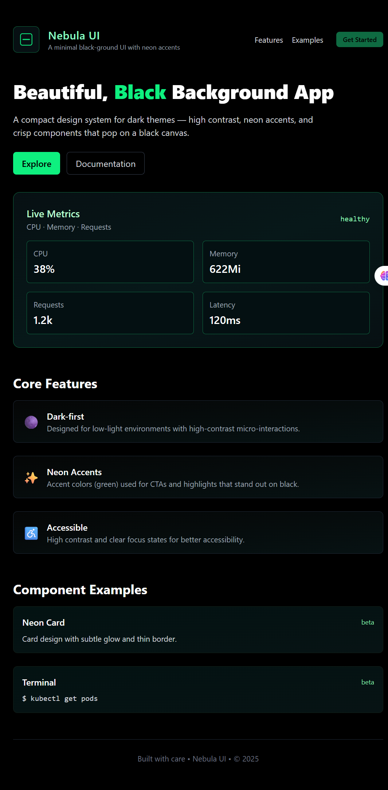

# 🌌 Nebula UI App


> A modern, responsive static web app built with **React**, deployed on **Azure Static Web Apps**, featuring clean architecture and automated CI/CD integration.

---

## 🎯 Project Aim
The **Nebula UI App** demonstrates:

- A fully responsive React front-end application with optimized production build.
- Continuous Deployment using **Azure Static Web Apps**.
- Proper GitHub Actions workflow for automated CI/CD.
- Best practices in project structure, `.gitignore`, and secret management.

---

## 🗂 Project Structure
```text
nebula-ui-app/
├── nebula-ui/              # React app source code
│   ├── public/
│   ├── src/
│   └── package.json
├── .github/
│   └── workflows/
│       └── azure-static-web-apps.yml  # CI/CD workflow
├── assets/                  # Screenshots, images, GIFs
├── .gitignore
└── README.md
```

---

## ⚡ Features
- Responsive React UI
- Fast production build
- CI/CD with GitHub Actions → Azure
- Environment-safe secrets via GitHub Secrets
- Clear separation of source and build directories

---

## 🚀 Deployment Steps

### 1️⃣ Connect Repo to Azure
1. Create a **Static Web App** in the Azure Portal.
2. Link your **GitHub repository**.
3. Skip Azure's auto workflow if you already have one.

### 2️⃣ Set GitHub Secrets
- Add `AZURE_STATIC_WEB_APPS_API_TOKEN` (from Azure) to GitHub secrets.

### 3️⃣ Workflow Configuration
```yaml
app_location: "nebula-ui"
api_location: ""
output_location: "nebula-ui/build"
```

### 4️⃣ Build & Deploy
```bash
npm install
npm run build
```
- Workflow triggers GitHub Actions automatically to deploy the app.

---

## ⚙️ Technologies Used
| Technology       | Version / Type      |
|-----------------|-------------------|
| React            | 18.x              |
| Node.js          | 18.20.8           |
| GitHub Actions   | CI/CD             |
| Azure            | Static Web Apps   |

---

## 🛠 Local Setup
```bash
git clone https://github.com/Yemmmyc/my-first-azure-pipeline.git
cd my-first-azure-pipeline/nebula-ui
npm install
npm start
```
- Open [http://localhost:3000](http://localhost:3000) in your browser.

---

## ✅ Deployment Workflow


1. Push to `main` branch.
2. GitHub Actions builds React app.
3. Oryx prepares the production build.
4. Azure Static Web Apps hosts the app automatically.

---

## 📸 Screenshots & GIFs

### Full-page Screenshot


---

## 🔧 Troubleshooting
- **BadRequest / API Key invalid** → verify token in GitHub Secrets.
- **Artifact folder missing** → check `output_location` in workflow.
- **Node version mismatch** → ensure Node version in workflow matches local project.

---

## 📌 Notes
- Only one active workflow is recommended.
- Always keep `.gitignore` updated.
- Monitor GitHub Actions logs for deployment issues.

---

## 📝 Author
**Yemisi** – IT & DevOps Enthusiast  
[GitHub](https://github.com/Yemmmyc)


